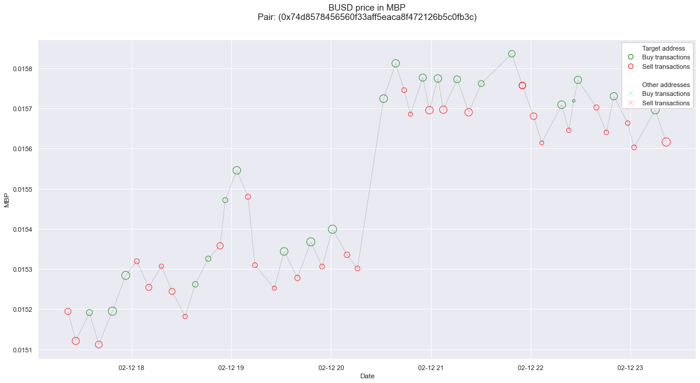
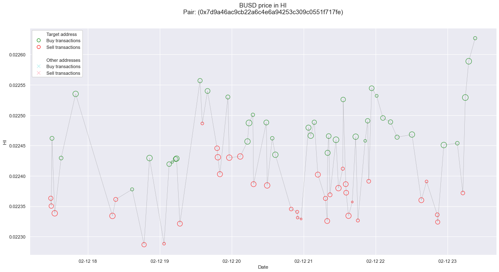
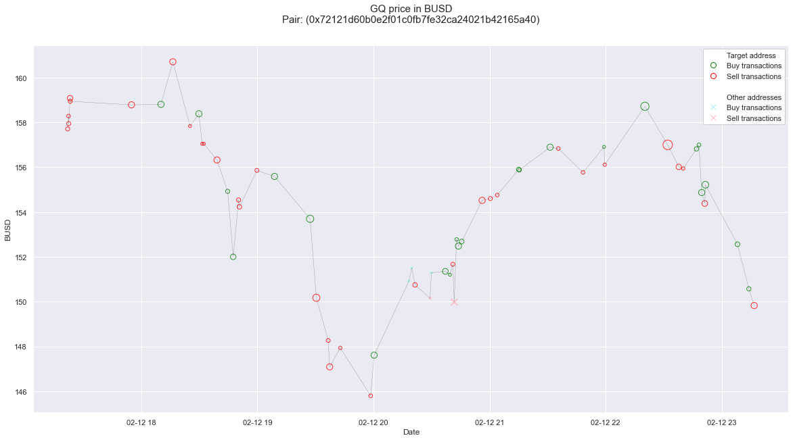

# Wash Trading Detection on AMM Decentralized Exchanges

## Abstract

Due to the recent rise in popularity of Automated Market Maker Decentralized Exchange, illicit conduct has become widespread in those marketplaces. As there were no studies that evaluated how to detect and quantify wash trading in these exchanges, this research employs a basic z-score statistical method to propose a solution. The complexity of the issue lies in the specificity of the on-chain data, as AMM DEX transactions do not have the bilateral data to implement existing methods for the identification of these activities. This research develops a straightforward yet effective approach to finding or analyzing AMM DEXs, such as Pancake Swap or UniSwap. The results represent only a small portion of the potential wash traded volumes, but it efficiently defines the types and patterns of these malicious activities.

This code accompanies the research paper:

### **[Wash Trading Detection on AMM Decentralized Exchanges](Wash-Trading-Detection-on-AMM-Decentralized-Exchanges.pdf)**

Henrikas Krukauskas  
New York University Shanghai, 2022.

## Examples of the Results

All these results represent a collected data of the latest 6 hours collected at that point in time.

### **BUSD price in MBP**

The shape of wash traded transactions' dataframe: **(53, 22)**.  
The shape of other transactions' dataframe: **(0, 22)**.  
The percentage of volume traded in this specific pair contract address: **100.00%**  
The position ratio: **1.1975459316349801**  
The number of accounts that commited wash trading: **4**
| Wash Traders |
| :----------- |
| 0x018b80c13684c481f72f09ac817a43bf1d3b776d |
| 0x0b9e4c3298ec58a6655d06e2727733de87516e9f |
| 0xf4e6ab2ef6b593eb3d995b9c90b416d294de3152 |
| 0xfac3e21ec7f380510e2161560680645c196a438c |

https://bscscan.com/address/0x74d8578456560f33aff5eaca8f472126b5c0fb3c#tokentxns

### **BUSD price in HI**

The shape of wash traded transactions' dataframe: **(76, 22)**.  
The shape of other transactions' dataframe: **(0, 22)**.  
The percentage of volume traded in this specific pair contract address: **100.00%**  
The position ratio: **0.8911801612643678**  
The number of accounts that commited wash trading: **10**  
| Wash Traders |
| :----------- |
| 0x03cfe3ee1924d9fc0e5215a71f5ba6f2903ef733 |
| 0x1409d881797158abc4830265ea852bafd6f41421 |
| 0x19f0966e32c136996aa9e694fcc0add0f84d4dde |
| 0x1d1ac07b915022d5f4e0f34aa19739423cd2e860 |
| 0x44378f25a462cc5de3ff85a7445d1c94a1df480d |
| 0x5071af5b78ca0809ee4abfeb3894b23ba6276682 |
| 0x9a71905450cdb6c0dd1a36f17e973d271e216e13 |
| 0xb5b38283786ac8791398112e88cbec5a524846d2 |
| 0xcc2a3606080d8fbf13660164dba740e99252c79f |
| 0xf8abdf124c9c7b2b3b012c3422507df03a25debb |

https://bscscan.com/address/0x7d9a46ac9cb22a6c4e6a94253c309c0551f717fe#tokentxns

### **GQ price in BUSD**

The shape of wash traded transactions' dataframe: **(55, 22)**.  
The shape of other transactions' dataframe: **(5, 22)**.  
The percentage of volume traded in this specific pair contract address: **64.96%**  
The position ratio: **1.0198285130601112**  
The number of accounts that commited wash trading: **19**
| Wash Traders |
| :----------- |
| 0x09a3bf35590488f178e2fa0ce855b10db28cd64c |
| 0x0b34fe6847c8c151db5d60781b093bdb2e96c48d |
| 0x0e7306cb9c01708778533396fae9d311d3bdcc65 |
| 0x2135bf3ec89b8fd182d087f9a3f00dcc1e4a8228 |
| 0x324ec7743a70212299ae82ad674f7547e6b4069d |
| 0x34cf45f0097989109889c588ea2f4c08668a4a2d |
| 0x3747eba039d945371bd73a16d17a43cba7f4a0d2 |
| 0x38bebea4ad6cf659d8df7eb9ffd30df8ae0931a5 |
| 0x38e21aad71e5f20c7937ab022a01f497bcbc2dea |
| 0x4f91e50566120e53309dff2e0c3fcbe36e2f3a4a |
| 0x64a19025d49883ee0875916dd299d362a42a6156 |
| 0x6a5feb792575f1fbbb45bfca0df96cc2eaeb5cf8 |
| 0x6d9f2a9ffe25442674302cbbae41564b40d9e85c |
| 0x6f2f9bedbad348978215c2d7a7a2583dad895f25 |
| 0xa848cc62410355373278ca8146700f78a2557032 |
| 0xb22eae9b709a02bcbc02e3e3811034d591f6ea08 |
| 0xb7926d977476bfa3151e44236f1ac2d3928a47d7 |
| 0xe68f84597ffacaa21cedfd2ba43f95ff6aade433 |
| 0xed3f8e85203779ab6250cd549d38de8209afac84 |

https://bscscan.com/address/0x72121d60b0e2f01c0fb7fe32ca24021b42165a40#tokentxns

